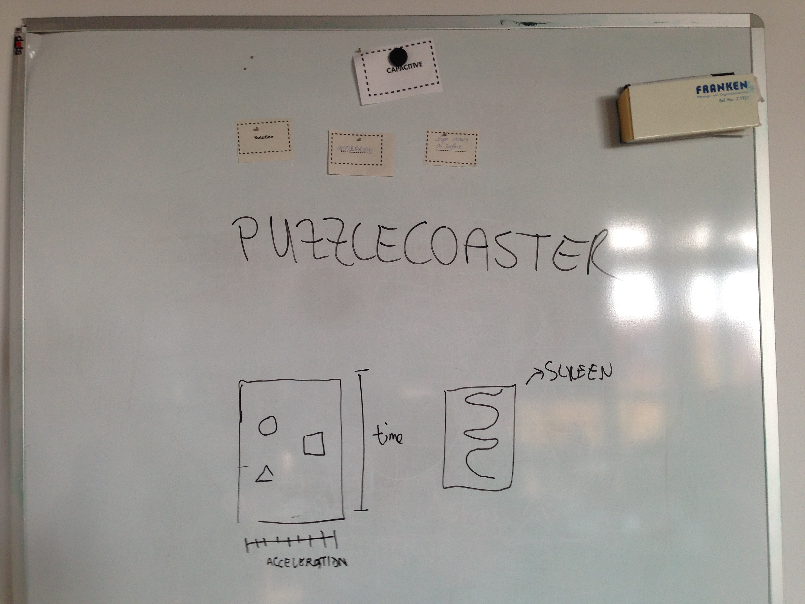

Ideation exercise
=================

Concepts generated using one random technology and three random parameters in 3 rounds (see the cards inside the [idea-generator](https://github.com/FH-Potsdam/2014-2015-WiSe-15PP-PW-DIY-Multitouch/tree/master/ideation/idea-generator) folder)

## Round 1

### Slim Jumber
__Tech:__ Optical
__Params:__ Size, Volume
__Concept:__ The higher you jumped, the higher the tone will be, the more points you'll get

### Knocking
__Tech:__ Acustical
__Params:__ Proportion, Volume, Position
__Concept:__ Detect position of knocks

 

### Gesture Drawing
__Tech:__ Resistive
__Params:__ Pressure Force, Size, Rotation
__Concept:__ 
- Use pressure on displays
- Use drawing gestures to perform rotations or other operations. 
- Each gesture represents an operation (circle = rotation, cross = panning).

 

### TRAILS
__Tech:__ Resistive
__Params:__ 
__Concept:__ 
- City trails, night trails...
- People sitting at bars

 

## Round 2

### Horrorcube
__Tech:__ Capacitive
__Params:__ Lightness, rotation, volume
__Concept:__ 
- Music player: for example, a cube
- Twist it over to change the music
- A more physical to work with music

 

### Soundgraffiti
__Tech:__ Acustical
__Params:__ 
__Concept:__
- Room
- Microphones on everycorner
- A transponder in the middle
- Projection that visualizes the output inside the room 

 

### Dancemasters 3K
__Tech:__ Optical
__Params:__ 
__Concept:__
- Large room with a projection in the floor
- Music turns on and you see patterns
- 2 groups of people dancing, who have to follow the patterns
- The system recognizes if people follows the patterns correctly

 

### Kalleido-crowd
__Tech:__ Capacity
__Params:__ Blob number, color, pressure force
__Concept:__
- Room of people, exhibition...
- Color tracking (people clothes, etc)
- Visualizes how people are moving deppending on their clothes (like a calleidoscope)
- See in which corner there are more people, etc.
- Pressure-sensitive gloves, people proximity

 

## Round 3

### Living Instruments
__Tech:__ Optical
__Params:__ Volume, Proportion, speed of blobs
__Concept:__
- When you enter a room, you become an instrument
- You decide which instrument you want to be
- You play the instrument by moving inside the room (it could change if you move making small or large steps, etc.)

 

### Modular Sound Creator
__Tech:__ Optical
__Params:__ Patterns, Lightness and blob number
__Concept:__
- Create sounds with patterns, predefined shapes
- Objects can be connected
- With the lightness (pointing an object with a light) you could change the effects
- Make drawings and create new sounds (?)

 

### Puzzlecoaster
__Tech:__ Capactive
__Params:__ 
__Concept:__
- 2 parts: interactive and non-interactive
- Interactive: Rollercoaster game
- Non-interactive: map
- Shapes: Interactive objects. They have to be placed onto the table
- 2 axis: acceleration / time

 

### Fingerpainter
__Tech:__ Resistive
__Params:__ Size, proportion and color
__Concept:__
- Canvas where you can paint with your fingers, but you can paint the walls where your installation is.
- With gestures you can adjust the drawing to fit the installation

 

## After-workshop Round

Any other ideas? :)

### Idea title
__Tech:__ Which tech do you use?
__Params:__ Which parameters?
__Concept:__