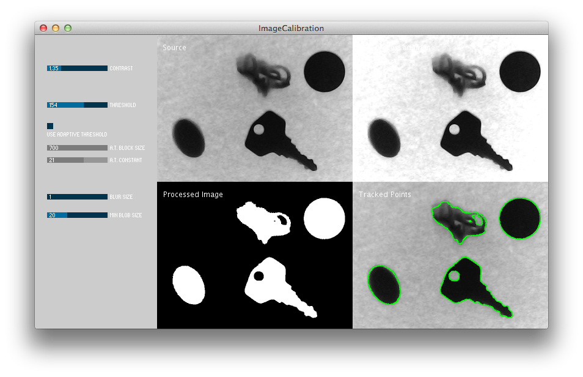
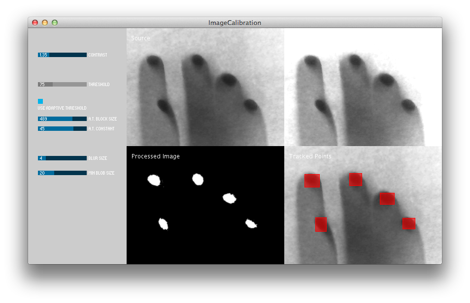
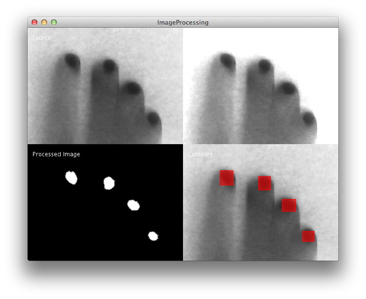
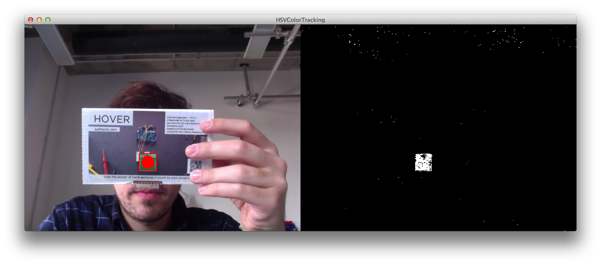
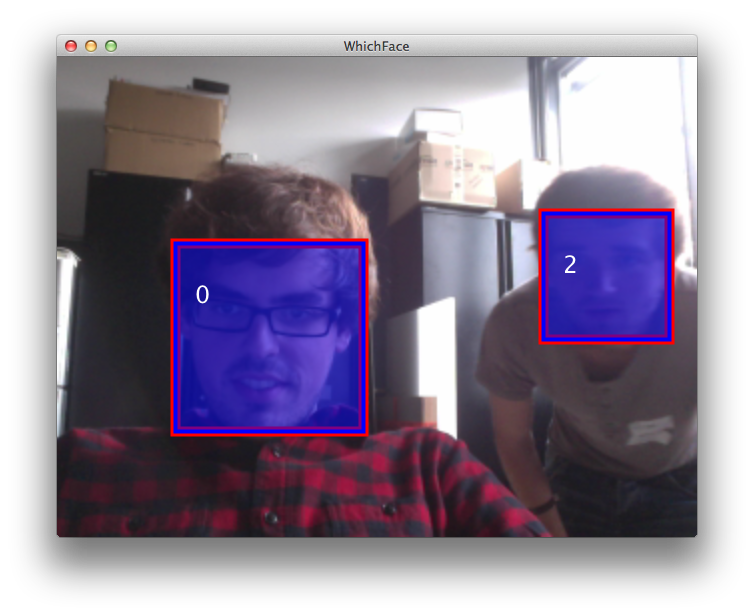
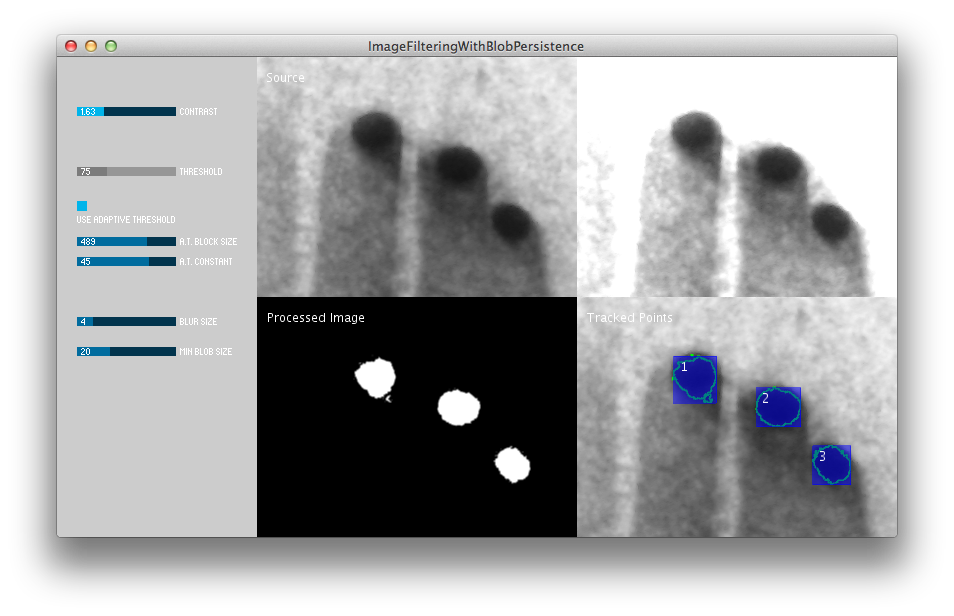

Computer Vision with OpenCV
===========================

Here we are basically doing the same than with the [bare bones examples](https://github.com/FH-Potsdam/2014-2015-WiSe-15PP-PW-DIY-Moultitouch/blob/master/bare-bones-cv) but using an external library for the computer vision operations (image filtering): the [OpenCV library for Processing](https://github.com/atduskgreg/opencv-processing) (by Greg Borenstein).

##Computer Vision: introduction
> _Computer Vision_ refers to a broad collection of techniques that allow computers to make intelligent assertions about what's going on in digital images and video. Thanks to recent advances in affordable vision technologies (such as Kinect, IR webcams, and Leap Motion), and armed with a slew of powerful but simple heuristics (tricks!) for extracting useful information from images -- a large number of artists and designers have begun to explore the new possibilities for interaction made possible by cameras. (Kyle McDonald)

Golan Levin has compiled some thoughts on the history of computer vision in his essay [Computer Vision for Artists and Designers](http://www.flong.com/texts/essays/essay_cvad/) and as part of his course [Interactive Art and Computational Design](http://golancourses.net/2013/lectures/lecture-02-25/).

##Install  

Download the last release version from [here](https://github.com/atduskgreg/opencv-processing/releases) and copy it in the Processing libraries folder.

Or clone the repository from terminal like this:  

    cd ~/Documents/Processing/libraries && git clone https://github.com/atduskgreg/opencv-processing

This can be a little tricky: rename the folder to `opencv_processing` and the `lib` folder inside it to `library`.

> __Note__: There are also other OpenCV implementations for Processing but I don't recommend them since they are old and have a trickier synthax.

##Filtering the image for blob detection

The following sketch should help us to filter the source image for blob detection. It requires the [controlP5](http://www.sojamo.de/libraries/controlP5/) library.

Code: [ImageFiltering.pde](https://github.com/FH-Potsdam/2014-2015-WiSe-15PP-PW-DIY-Moultitouch/blob/master/open-cv/ImageFiltering/ImageFiltering.pde)

The sketch is using the following filters:

- __Adjust contrast:__ highlight blobs
- __Thresholding:__ (Basic OR adaptive)
- __Noise reduction:__ (with dilation and erosion)
- __Blur filter:__ to remove remaining background noise
- __Set minimal blob size:__ to eliminate small blobs (spots, etc) that may be in the background.

As you will see, it's not much different than retouching an image with Photoshop, but with code :-)

#### Using basic thresholding

Thresholding is one of the most important filtering operations.

### Using adaptive thresholding
Adaptive thresholding is a more advanced option to filter your image. For environments with changing illumination or if you simply get a source image with shadows or irregular illumination, try better this. You can see an example in the next image, where the 

Just open the sketch and do some tests ;)

### Using adaptive thresholding

You can then grap your filter values and place them in your own one. 

As a code skeleton you can use [ImageFiltering.pde](https://github.com/FH-Potsdam/2014-2015-WiSe-15PP-PW-DIY-Moultitouch/blob/master/open-cv/ImageProcessing/ImageProcessing.pde). Basically it does the same but it gets the filter values hardcoded.

You should see something like this:

## Color Tracking

Simple color tracking based on the hue channel.

Code: [HSVColorChannel.pde](https://github.com/FH-Potsdam/2014-2015-WiSe-15PP-PW-DIY-Moultitouch/tree/master/open-cv/HSVColorTracking/HSVColorTracking.pde)

For a multiple color tracking, check this sketch:

Code: [MultipleColorChannel.pde](https://github.com/FH-Potsdam/2014-2015-WiSe-15PP-PW-DIY-Moultitouch/tree/master/open-cv/MultipleColorChannel/MultipleColorChannel.pde)

## Blob persistence (memory) over time

For some applications it may be important to "follow" a blob or an object over time (as markers or TUIO do).

> "One of the most common questions I get regarding blob tracking is “memory.” How do I know which blob is which over time? Computer vision libraries, for the most part, simply pass you a list of blobs (with x, y, width, and height properties) for any given moment in time. But the blobs themselves represent only a snapshot of that particular moment and contain no information related to whether the blobs existed before this very moment. This may seem absurd given that as human beings it’s so easy for us to watch a rectangle moving across a screen and understand conceptually that it is the same rectangle. But without additional information (such as color matching, an AR marker, etc.) there’s no way for an algorithm that analyzes one frame of video to know anything about a previous frame. And so we need to apply the same intuitions our brain uses (it was there a moment ago, it’s probably still there now) to our algorithms" (by [Daniel Shiffman](http://shiffman.net/2011/04/26/opencv-matching-faces-over-time/))

The sketch [WhichFace](https://github.com/FH-Potsdam/2014-2015-WiSe-15PP-PW-DIY-Moultitouch/tree/master/open-cv/WhichFace) implements a persistence algorithm that follows faces over time. It is a modification of Daniel Shiffman's algorithm that works with OpenCV (the example in his blog is using an old version).

Code:
- [WhichFace.pde](https://github.com/FH-Potsdam/2014-2015-WiSe-15PP-PW-DIY-Moultitouch/tree/master/open-cv/WhichFace/WhichFace.pde): main sketch
- [Face.pde](https://github.com/FH-Potsdam/2014-2015-WiSe-15PP-PW-DIY-Moultitouch/tree/master/open-cv/WhichFace/Face.pde): the Face class

The same algorithm is also implemented in the `ImageFilteringWithBlobPersistence` example to track the blobs over time:

Code:
- [ImageFilteringWithBlobPersistence.pde](https://github.com/FH-Potsdam/2014-2015-WiSe-15PP-PW-DIY-Moultitouch/tree/master/open-cv/ImageFilteringWithBlobPersistence/ImageFilteringWithBlobPersistence.pde): main sketch
- [Blob.pde](https://github.com/FH-Potsdam/2014-2015-WiSe-15PP-PW-DIY-Moultitouch/tree/master/open-cv/ImageFilteringWithBlobPersistence/Blob.pde): the Blob class

To see a detailed information of this algorithm visit Daniel Shiffman's blog:
http://shiffman.net/2011/04/26/opencv-matching-faces-over-time/

##More
For more info about OpenCV and more examples, visit the librarys's github repository:
[https://github.com/atduskgreg/opencv-processing](https://github.com/atduskgreg/opencv-processing)

The plugin's author, Greg Borenstein, is also working on a book. You can check some more examples and doc pages in its repository:
[https://github.com/atduskgreg/opencv-processing-book](https://github.com/atduskgreg/opencv-processing-book)

