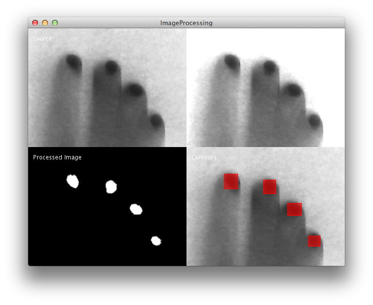

Computer Vision with OpenCV
======

##Install  

install for example like this:  

    cd ~/Documents/Processing/libraries && git clone https://github.com/atduskgreg/opencv-processing

Here we are basically doing the same than with the [bare bones examples](https://github.com/FH-Potsdam/2014-2015-WiSe-15PP-PW-DIY-Moultitouch/blob/master/bare-bones-cv) but using an external library for the computer vision operations (image filtering): the [OpenCV library for Processing](https://github.com/atduskgreg/opencv-processing) (by Greg Borenstein).

> __Note__: There are also other OpenCV implementations for Processing but I don't recommend them since they are old and have a trickier synthax.

##Calibrating the image for blob detection

The following sketches should help us to calibrate the camera for an effective filtering and blob detection.

Code: [ImageCalibration.pde](https://github.com/FH-Potsdam/2014-2015-WiSe-15PP-PW-DIY-Moultitouch/blob/master/open-cv/ImageCalibration/ImageCalibration.pde)

The sketch is using the following filters:

- __Adjust contrast:__ highlight blobs
- __Thresholding:__ (Basic OR adaptive)
- __Noise reduction:__ (with dilation and erosion)
- __Blur filter:__ to remove remaining background noise
- __Set minimal blob size:__ to eliminate small blobs (spots, etc) that may be in the background.

As you will see, it's not much different than retouching an image with Photoshop, but with code :-)

#### Using basic thresholding

Thresholding is one of the most important filtering operations.

#### Using adaptive thresholding
Adaptive thresholding is a more advanced option to filter your image. For environments with changing illumination or if you simply get a source image with shadows or irregular illumination, try better this. You can see an example in the next image, where the 

Just open the sketch and do some tests ;)

#### Using adaptive thresholding

You can then grap your filter values and place them in your own one. 

As a code skeleton you can use [ImageCalibration.pde](https://github.com/FH-Potsdam/2014-2015-WiSe-15PP-PW-DIY-Moultitouch/blob/master/open-cv/ImageProcessing/ImageProcessing.pde). Basically it does the same but it gets the filter values hardcoded.

You should see something like this:

##More
For more info about OpenCV and more examples visit the plugins GitHub page:
[https://github.com/atduskgreg/opencv-processing](https://github.com/atduskgreg/opencv-processing)

The plugin's author is also working on a book. You can check some more examples and info pages in its repository:
[https://github.com/atduskgreg/opencv-processing-book](https://github.com/atduskgreg/opencv-processing-book)

