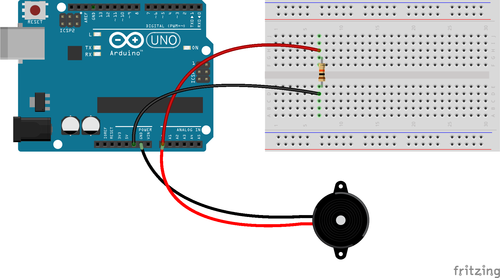
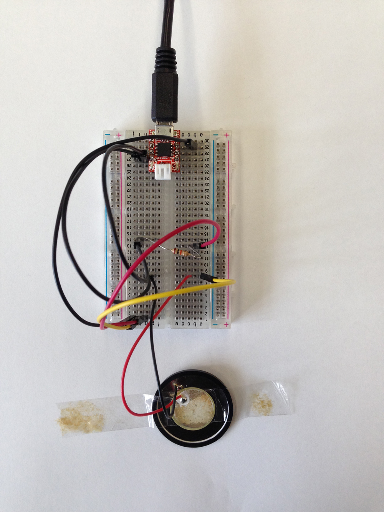
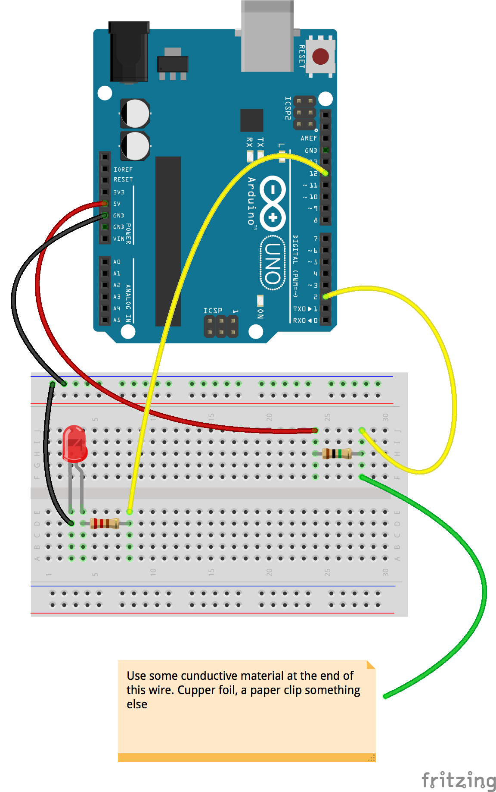
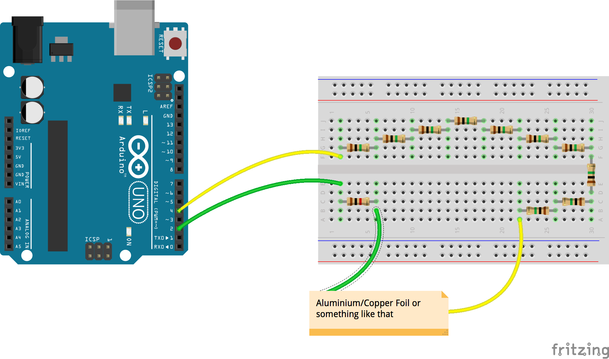

physical touch (less)
=====================

##Acoustic Detectection

###Knock

Based [on this](http://arduino.cc/en/Tutorial/Knock) and [that](http://www.arduino.cc/en/Tutorial/KnockSensor).  

  

####Using Arduino  
- Connect Arduino analog pin 0 to the + leg of the piezo
- Connect the - leg of the piezo to the ground
- Connect analog pin 0 to a 10kOhm resistor
- Connect that resistor back to the Arduino.  
- Upload the sketch [knock.ino](arduino/knock/knock.ino) to your board and knock on the piezo or the table.  
__Hint:__

The result is better if the table or plate the piezo is sensing has the possibility to swing. A hard table that does not swing needs harder knocks.  
Adjust the reading by reducing or incresing the resistor value. You could also use a potentiometer (variable resistor) instead.  

####Using Olimexino  

To keep the costs low and or if you are in the need of even more microcontrollers you can use the olimexino. It is a low cost miniatur board. The hookup is the same as for the arduino. See the image and use the sketch [knock_olimexino_85s.ino](olimexino-85s/knock_olimexino_85s/knock_olimexino_85s.ino)  

##Capacitiv Detection  

###Capacitiv Digital  

Based on [instructables.com Turn a pencil drawing into a capacitiv sensor](http://www.instructables.com/id/Turn-a-pencil-drawing-into-a-capacitive-sensor-for/?ALLSTEPS)  

  

- Connect digital pin 2 to a 1MOhm resistor and to your paperclip (or something else that is conductive). Connect the resistor to the 5V of the Arduino board.  
In this sketch we use a LED on pin 12. Protect that LED with an 220Ohm resistor. You could also skip this part and just use pin 13 with its build on LED.  
- So connect pin 12 to the 220Ohm resistor.
- Connect the resistor to the long leg (anode) of the LED.
- Connect the short leg (catode) back to the ground.  
- Upload the sketch [capacitive_digital.ino](/arduino/capacitive_digital/capacitive_digital.ino) to your board and touch the paperclip or foil.  
- 

###Capacitiv Touchless (Proximity) Detection  
Based on [CapacitiveSensor playground.arduino.cc](http://playground.arduino.cc/Main/CapacitiveSensor?from=Main.CapSense)  

  

- Download and install the [CapacitiveSensor library](https://github.com/PaulStoffregen/CapacitiveSensor/archive/master.zip)  
- Connect Arduino digital pin 4 to a 10MOhm or more (send pin). The higher the value the the greater gets the distance which you can detect.  
- Connect the 10MOhm resistor connected to the send pin to a piece of copper or aluminium foil
- Connect the foil to a 1kOhm resistor.
- Connect Arduino digital pin 2 to the 1kOhm resistor (recive pin). This is just for protecting the pin.  
- Open the example sketch of the CapacitiveSensor Library and adjust it to your needs.  
- Watch the magic happen.  

__Hint:__

If your board is connected to the computer you __must__ be connected to the charger. If not your results will be unpredictable. When using an external power source you need to connect it to ground. Play with it and see the original tutorial for further infos.
