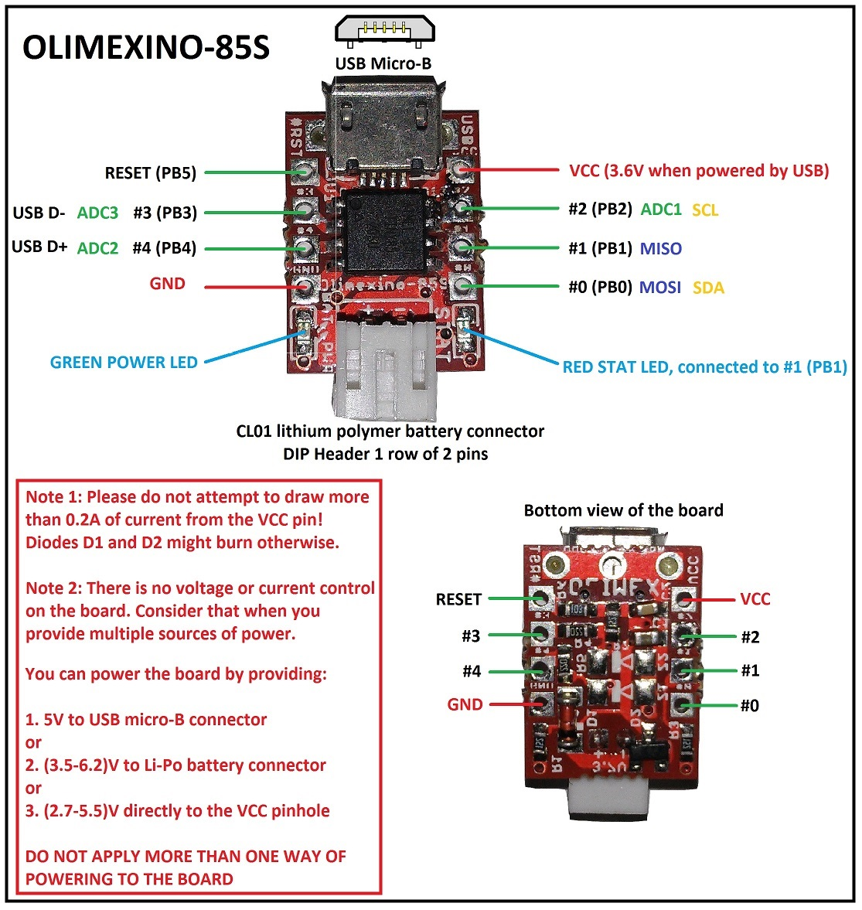

olimexino-s85
=============

The [olimexino s85](https://www.olimex.com/Products/Duino/AVR/OLIMEXINO-85S/open-source-hardware) is a very tiny cheap (5€) protoboard based on the Attiny 85 chip. It has not all the capabilities of an full arduino board but it is equipped with an li-poly adapter and can be programmed via USB.  

See the [pin layout here](https://www.olimex.com/Products/Duino/AVR/OLIMEXINO-85S/resources/OLIMEXINO-85s_pinout.jpg) and read the [hookup guide here](http://digistump.com/wiki/digispark/tutorials/connecting#your_first_upload)  

Download the costum [Arduino IDE here](http://digistump.com/wiki/digispark/tutorials/connecting) and get the [examples here](https://www.olimex.com/Products/Duino/AVR/OLIMEXINO-85-ASM/resources/ATtiny85_demos.zip)  

This is the pinout for the olimexino. Taken from their site.  

###Knock  

Hook up a piezo at analog pin 1 (it has in the pinout the number two) and knock on yout table to get some results.

  

##License

Images taken from olimex.com all rights to the original creators.  

All sourcecode is under  
The MIT License (MIT)  
Copyright © 2014 Fabian Morón Zirfas  

Permission is hereby granted, free of charge, to any person obtaining a copy
of this software and associated documentation files (the “Software”), to deal
in the Software without restriction, including without limitation the rights
to use, copy, modify, merge, publish, distribute, sublicense, and/or sell
copies of the Software, and to permit persons to whom the Software is  
furnished to do so, subject to the following conditions:  

The above copyright notice and this permission notice shall be included in
all copies or substantial portions of the Software.  

THE SOFTWARE IS PROVIDED “AS IS”, WITHOUT WARRANTY OF ANY KIND, EXPRESS OR
IMPLIED, INCLUDING BUT NOT LIMITED TO THE WARRANTIES OF MERCHANTABILITY,
FITNESS FOR A PARTICULAR PURPOSE AND NONINFRINGEMENT. IN NO EVENT SHALL THE
AUTHORS OR COPYRIGHT HOLDERS BE LIABLE FOR ANY CLAIM, DAMAGES OR OTHER
LIABILITY, WHETHER IN AN ACTION OF CONTRACT, TORT OR OTHERWISE, ARISING FROM,
OUT OF OR IN CONNECTION WITH THE SOFTWARE OR THE USE OR OTHER DEALINGS IN
THE SOFTWARE.  
