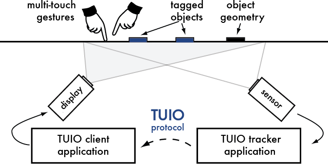

TUIO
====

  
>TUIO is an open framework that defines a common protocol and API for tangible multitouch surfaces. The TUIO protocol allows the transmission of an abstract description of interactive surfaces, including touch events and tangible object states. This protocol encodes control data from a tracker application (e.g. based on computer vision) and sends it to any client application that is capable of decoding the protocol. There exists a growing number of TUIO enabled tracker applications and TUIO client libraries for various programming environments, as well as applications that support the protocol. This combination of TUIO trackers, protocol and client implementations allows the rapid development of table based tangible multitouch interfaces. TUIO has been mainly designed as an abstraction for interactive surfaces, but also has been used in many other related application areas. Technically TUIO is based on Open Sound Control - an emerging standard for interactive environments not only limited to musical instrument control - and can be therefore easily implemented on any platform that supports OSC.  

>Since the initial publication of the TUIO protocol specification to the public domain as part of the Reactable synthesizer, after its first implementation within reacTIVision, the protocol has been also adopted by several other projects related to tangible and multitouch interaction, such as the NUI Group and several other tangible interaction platforms. Due to its widespread adoption since, the TUIO protocol and API can be considered a community standard, to which this web site provides the principal information repository, such as the actual protocol specification, the TUIO client API definition and many other resources that may be necessary or useful for the development of TUIO based interactive applications.  
[tuio.org](http://tuio.org/)  

There are several tracker applications out there.  

We will use [Community Core Vision](http://ccv.nuigroup.com/) or [reacTIVision](http://reactivision.sourceforge.net/). Currently reacTIVision for Mac OSX does not work. Even after compiling from source on 10.9 the application does not recognize any cameras. When the original download application is started via command line it crashes. We hope that [Martin Kaltenbrunner](http://modin.yuri.at/) will release a [new version](https://github.com/mkalten/reacTIVision) soon as stated on the sourceforge [forums here](https://sourceforge.net/p/reactivision/discussion/515398/thread/940e3138/). CCV does work.  

- Download and install [reacTIVision](http://reactivision.sourceforge.net/) or [CCV](http://ccv.nuigroup.com/).  
- Download and install the [TUIO Processing library](http://prdownloads.sourceforge.net/reactivision/TUIO_Processing-1.4.zip?download)

To get the processing lib running you need to rename the folder from `TUIO_Processing` to `TUIO`. Then drop it into your `~/Documents/Processing/libraries` folder.

Open the example TuioDemo and under the line 

    import TUIO.*;

add:

    import java.util.*;

Connect your camera from the IR USB cam hack and use `utils/CameraCheck/CameraCheck.pde` to see if your camera is working. (Test it with some IR remote).  

If that is working run CCV or reacTIVision.  

###Community Core Vision (CCV)  

  

On CCV make sure you check the "use camera" and the "send tuio (osc)" checkboxes.  
Now run the Processing demo and point some IR at the camera. You should have some `TuioCursor`.  

###reacTIVision

  

### OSCulator & Ableton Live 

You can use [osculator](http://www.osculator.net/) to transform OSC signals into e.g. Midi Notes to control other devices and software e.g. Ableton Live. This setup is tested but not fully documented.  
